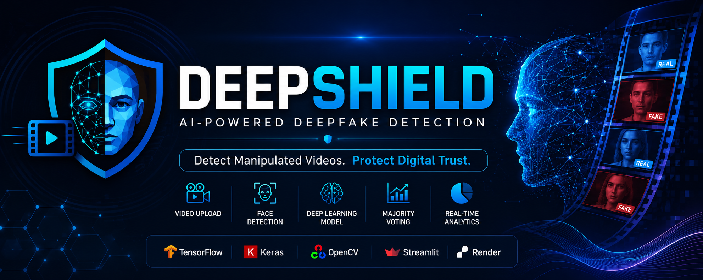
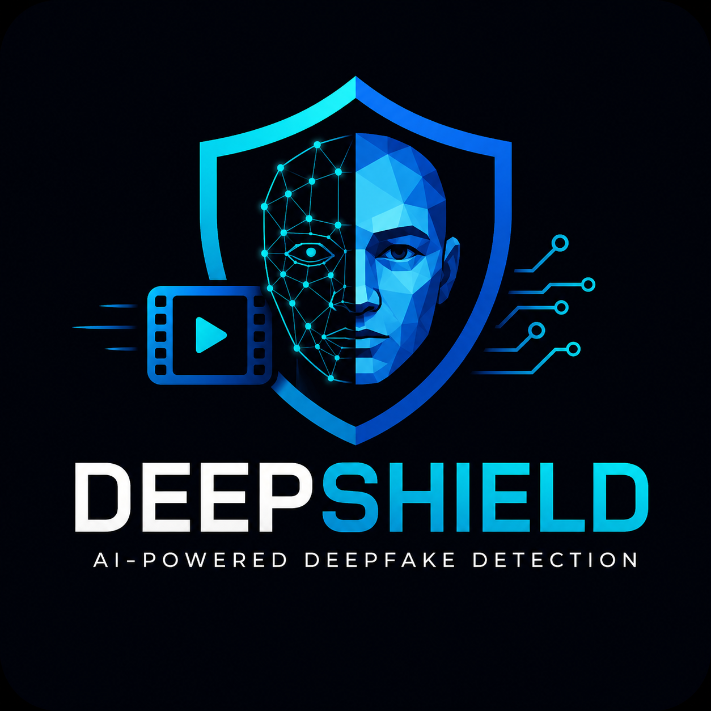
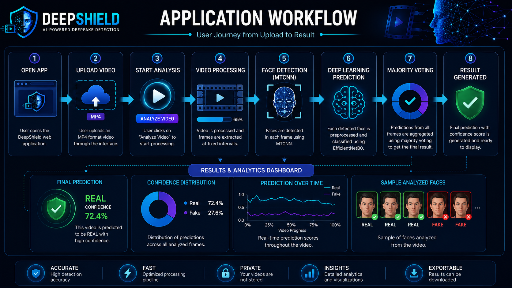
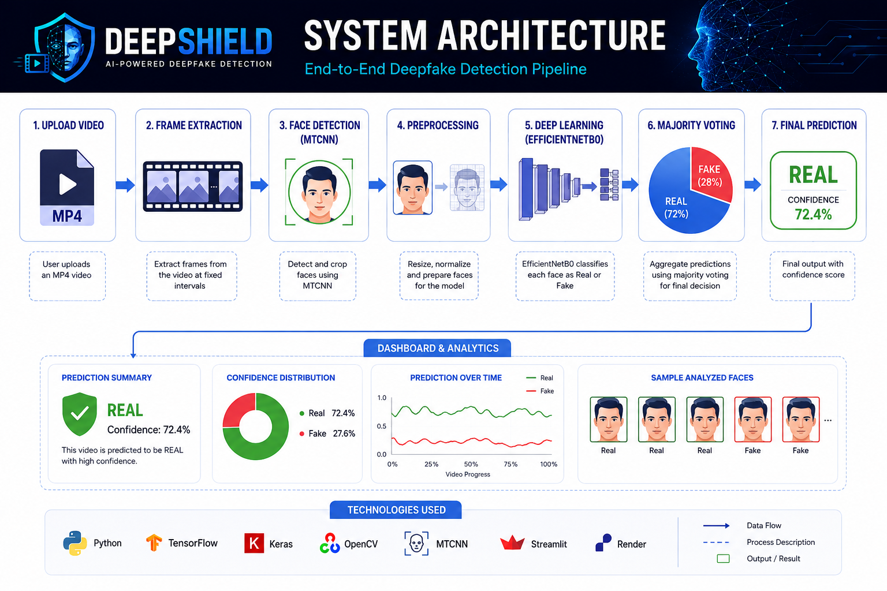
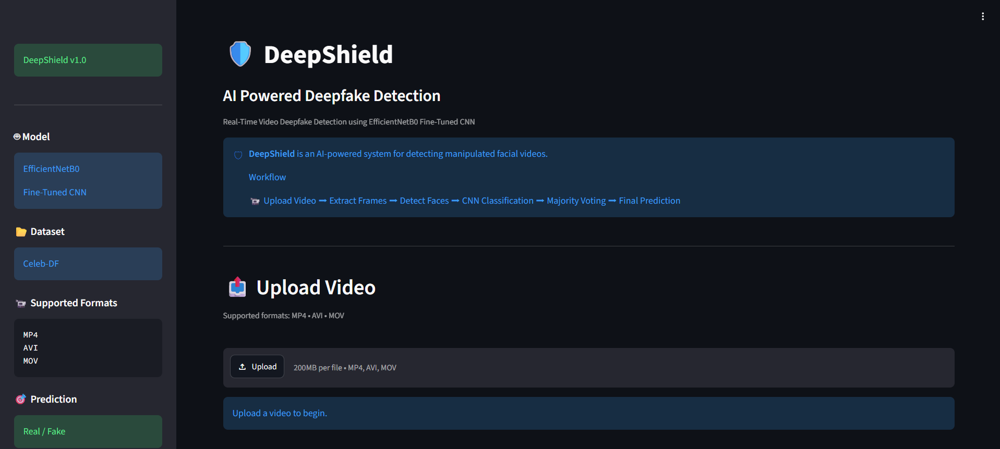
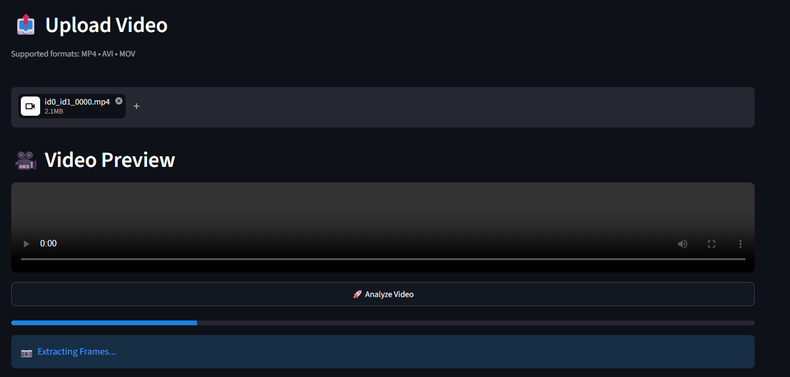
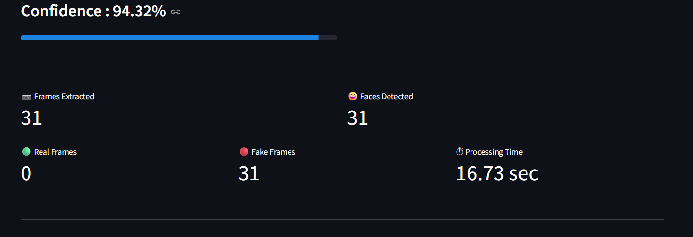
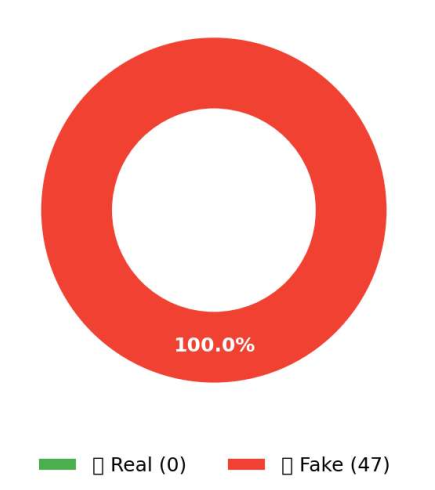
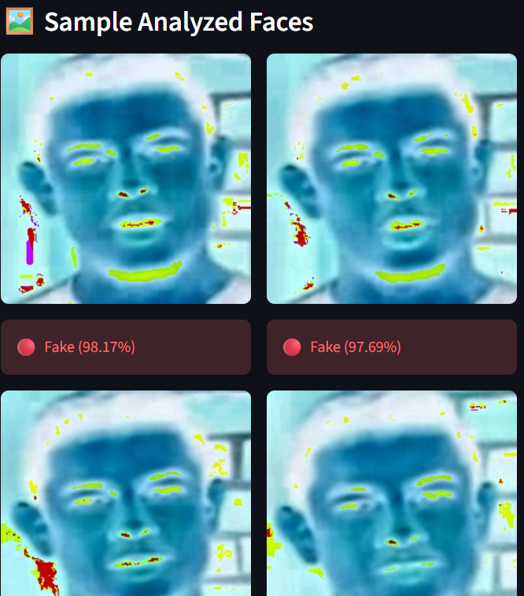
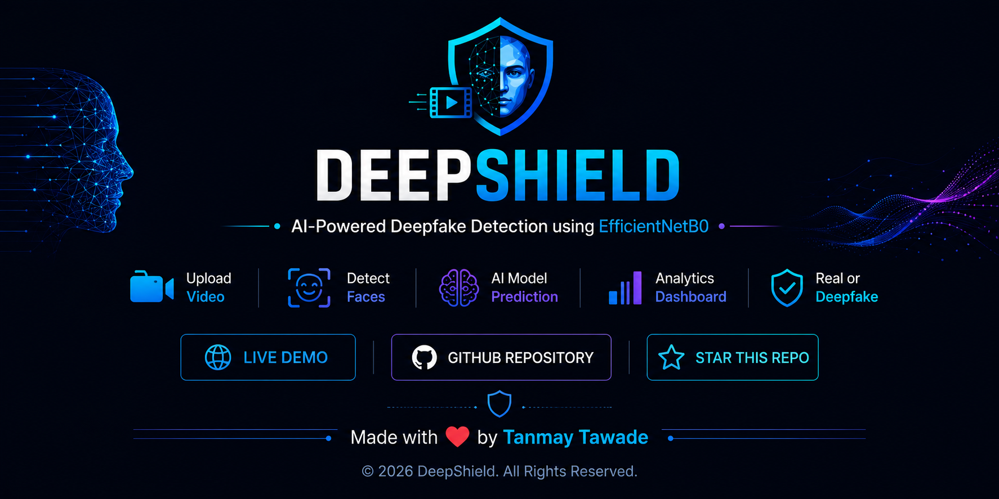

<p align="center">
  
</p>

<p align="center">
  
</p>

<p align="center">
<b>AI-Powered Deepfake Detection using EfficientNetB0 and Deep Learning</b>
</p>

<p align="center">
An end-to-end AI-powered web application that detects whether a video is <b>Real</b> or <b>Deepfake</b> using a fine-tuned EfficientNetB0 model, MTCNN face detection, and majority voting.
</p>

---

<p align="center">


</p>

---

## 🚀 Live Demo

<p align="center">

<a href="https://deepshield-cq6f.onrender.com/">

</a>

<a href="https://github.com/TanmayT134/DeepShield">

</a>

</p>

---

# 📌 Project Highlights

| Feature | Status |
|:---------|:------:|
| Deep Learning Model | ✅ |
| Video Analysis | ✅ |
| Face Detection (MTCNN) | ✅ |
| EfficientNetB0 Classification | ✅ |
| Majority Voting | ✅ |
| Analytics Dashboard | ✅ |
| Live Web Application | ✅ |
| Responsive Streamlit UI | ✅ |
| Open Source | ✅ |

---

# 📖 Overview

DeepShield is an end-to-end AI-powered web application designed to detect **AI-generated deepfake videos**.

The application analyzes uploaded videos by extracting frames, detecting faces using **MTCNN**, preprocessing each detected face, and classifying it with a **fine-tuned EfficientNetB0** deep learning model.

Instead of relying on a single frame prediction, DeepShield performs **majority voting** across all analyzed frames, making the final prediction more robust and reliable.

The system provides an intuitive dashboard that displays:

- Final Prediction
- Confidence Score
- Prediction Distribution
- Processing Statistics
- Sample Analyzed Faces

making it suitable for research demonstrations, portfolio projects, and educational purposes.

---

# ✨ Features

## 🎥 Video Processing

- Upload MP4 videos through an intuitive interface
- Automatic frame extraction from uploaded videos
- Intelligent face detection using **MTCNN**
- Face cropping and preprocessing
- Efficient handling of video frames

---

## 🧠 AI Prediction

- Fine-tuned **EfficientNetB0** deep learning model
- Binary classification (**Real / Fake**)
- Confidence score calculation
- Majority voting across all analyzed frames
- Robust prediction pipeline

---

## 📊 Interactive Dashboard

- Final prediction summary
- Confidence visualization
- Prediction distribution charts
- Processing statistics
- Sample analyzed face gallery
- Modern and responsive UI

---

## 🌐 Deployment

- Streamlit-based web application
- Dockerized deployment
- Hosted on Render
- Accessible from any modern web browser

---

# 🚀 Why DeepShield?

Deepfake technology has advanced rapidly, making manipulated videos increasingly difficult to identify manually.

DeepShield aims to address this challenge by combining **computer vision**, **deep learning**, and an intuitive web interface to provide an accessible and reliable deepfake detection solution.

The project demonstrates practical applications of:

- Artificial Intelligence
- Deep Learning
- Computer Vision
- Video Processing
- Model Deployment
- Full-Stack AI Application Development

--- 

<p align="center">
  
</p>

The following workflow illustrates how DeepShield processes an uploaded video from start to finish.

1. User uploads an MP4 video.
2. Frames are extracted from the video.
3. Faces are detected using **MTCNN**.
4. Detected faces are preprocessed.
5. The **EfficientNetB0** model predicts each face as **Real** or **Fake**.
6. Majority voting generates the final video prediction.
7. Results are displayed through an interactive dashboard with analytics and confidence scores.

---

<p align="center">
  
</p>

The DeepShield architecture consists of multiple stages that work together to provide accurate deepfake detection.

| Stage | Description |
|--------|-------------|
| 📤 Video Upload | User uploads an MP4 video. |
| 🎞 Frame Extraction | Video is converted into multiple frames. |
| 👤 Face Detection | MTCNN detects and crops faces from every frame. |
| 🖼 Image Preprocessing | Faces are resized and normalized before inference. |
| 🧠 Deep Learning Model | Fine-tuned EfficientNetB0 predicts each face as Real or Fake. |
| 📊 Majority Voting | Individual frame predictions are aggregated into a final decision. |
| 📈 Dashboard | Displays prediction, confidence, analytics, and sample analyzed faces. |

---

# 📸 Application Screenshots

The screenshots below demonstrate the DeepShield user interface during different stages of analysis.

| Home Page | Video Upload |
|------------|--------------|
|  |  |

| Processing | Final Prediction |
|------------|------------------|
|  |  |

| Sample Analyzed Faces |
|-----------------------|
|  |

---

# 📊 Model Performance

The EfficientNetB0 model was fine-tuned on a balanced deepfake dataset to classify videos into **Real** and **Fake** categories.

| Metric | Value |
|:--------|------:|
| Accuracy | **80.60%** |
| Precision | **87.74%** |
| Recall | **71.15%** |
| ROC-AUC | **89.88%** |

---

## 📈 Performance Summary

| Evaluation | Status |
|------------|:------:|
| Model Trained | ✅ |
| Fine-Tuned | ✅ |
| Binary Classification | ✅ |
| EfficientNetB0 Backbone | ✅ |
| Majority Voting | ✅ |
| Live Deployment | ✅ |

---

> **Note**
>
> The reported metrics were obtained using the final fine-tuned EfficientNetB0 model evaluated on the held-out test dataset. The prediction pipeline combines frame-level inference with majority voting to improve the robustness of video-level classification.

---

# 🛠️ Technology Stack

DeepShield combines modern Deep Learning, Computer Vision, and Web technologies to build a complete AI-powered deepfake detection system.

| Category | Technologies |
|----------|--------------|
| **Programming Language** | Python 3.10 |
| **Deep Learning Framework** | TensorFlow 2.21, Keras 3.12 |
| **CNN Model** | EfficientNetB0 (Fine-Tuned) |
| **Computer Vision** | OpenCV |
| **Face Detection** | MTCNN |
| **Data Processing** | NumPy, Pandas |
| **Visualization** | Matplotlib |
| **Frontend** | Streamlit |
| **Deployment** | Docker, Render |
| **Version Control** | Git & GitHub |

---

# 📂 Project Structure

```text
DeepShield/
│
├── app.py                     # Streamlit application
├── Dockerfile                 # Docker deployment
├── requirements.txt           # Project dependencies
├── README.md                  # Project documentation
│
├── assets/
│   ├── banner/
│   ├── architecture/
│   ├── workflow/
│   └── screenshots/
│
├── config/
│   └── config.py
│
├── models/
│   └── finetune/
│       └── best_cnn_finetuned.keras
│
├── src/
│   ├── preprocessing/
│   ├── inference/
│   ├── evaluation/
│   ├── training/
│   ├── models/
│   ├── utils/
│   └── explainability/
│
└── LICENSE
```

---

# 📁 Directory Overview

| Directory | Purpose |
|-----------|---------|
| **assets/** | Banner, workflow, architecture, screenshots and project images |
| **config/** | Central configuration settings |
| **models/** | Trained EfficientNetB0 model |
| **src/preprocessing/** | Video processing, frame extraction and preprocessing |
| **src/inference/** | Deepfake prediction pipeline |
| **src/training/** | Model training scripts |
| **src/evaluation/** | Model evaluation utilities |
| **src/utils/** | Helper functions |
| **app.py** | Main Streamlit application |

---

# ⚙️ Installation

## 1️⃣ Clone the Repository

```bash
git clone https://github.com/TanmayT134/DeepShield.git
```

```bash
cd DeepShield
```

---

## 2️⃣ Create a Virtual Environment

### Windows

```bash
python -m venv venv
venv\Scripts\activate
```

### Linux / macOS

```bash
python3 -m venv venv
source venv/bin/activate
```

---

## 3️⃣ Install Dependencies

```bash
pip install -r requirements.txt
```

---

## 4️⃣ Run the Application

```bash
streamlit run app.py
```

The application will start locally at

```text
http://localhost:8501
```

---

# 🚀 Usage

Using DeepShield is simple:

### Step 1

Launch the Streamlit application.

---

### Step 2

Upload an MP4 video.

---

### Step 3

Click **Analyze Video**.

---

### Step 4

The application will:

- Extract frames
- Detect faces using MTCNN
- Preprocess detected faces
- Predict each face using EfficientNetB0
- Apply majority voting
- Generate the final prediction

---

### Step 5

View the generated dashboard containing:

- ✅ Final Prediction
- 📊 Confidence Score
- 📈 Prediction Distribution
- 📷 Sample Analyzed Faces
- ⏱ Processing Statistics

---

# 💡 Why EfficientNetB0?

EfficientNetB0 was selected because it provides an excellent balance between:

- High classification accuracy
- Lightweight architecture
- Fast inference
- Efficient deployment
- Lower computational requirements

making it well suited for real-time deepfake detection applications.

---

# 🔒 Model Information

| Property | Value |
|----------|-------|
| Model | EfficientNetB0 |
| Task | Binary Classification |
| Classes | Real, Fake |
| Framework | TensorFlow / Keras |
| Input Size | 224 × 224 × 3 |
| Output | Softmax Probability |
| Decision Strategy | Majority Voting |

---

# 🔮 Future Enhancements

DeepShield is designed with extensibility in mind. The following features are planned for future releases.

### 🧠 Explainable AI (XAI)

- Grad-CAM++ visualization
- Model attention heatmaps
- Explainable predictions

---

### 🎥 Advanced Video Analysis

- Multi-face tracking
- Frame-level prediction timeline
- Real-time webcam analysis
- Batch video processing

---

### 📊 Enhanced Analytics

- Downloadable PDF reports
- Confidence trend visualization
- Detailed prediction statistics
- Frame-wise analysis report

---

### 🤖 AI Model Improvements

- Support for multiple deepfake datasets
- Ensemble learning
- Transformer-based architectures
- Higher detection accuracy

---

### ☁️ Deployment

- REST API support
- Mobile-friendly interface
- Cloud storage integration
- User authentication

---

# 🗺️ Project Roadmap

| Version | Status | Features |
|---------|:------:|----------|
| **v1.0** | ✅ | Video Upload, MTCNN, EfficientNetB0, Dashboard |
| **v1.1** | 🚧 | Performance Optimization |
| **v2.0** | 🔜 | Explainable AI (Grad-CAM++) |
| **v2.5** | 🔜 | Multi-face Tracking |
| **v3.0** | 🔜 | Real-time Detection & REST API |

---

# 🤝 Contributing

Contributions, ideas, and suggestions are always welcome.

If you'd like to improve DeepShield:

1. Fork the repository
2. Create a new feature branch
3. Commit your changes
4. Push your branch
5. Open a Pull Request

---

# 🙏 Acknowledgements

This project was made possible with the help of the following open-source technologies:

- TensorFlow
- Keras
- OpenCV
- MTCNN
- Streamlit
- Render
- NumPy
- Pandas
- Matplotlib

Special thanks to the open-source community for providing powerful tools and resources that made this project possible.

---

# 👨‍💻 Developer

**Tanmay Tawade.**

Electronics & Telecommunication Engineer

AI • Deep Learning • Computer Vision • Web Development

🔗 GitHub:
https://github.com/TanmayT134

---

# ⭐ Support

If you found this project useful,

- ⭐ Star this repository
- 🍴 Fork the project
- 📢 Share it with others

Your support motivates future development and improvements.

---

<p align="center">

</p>
